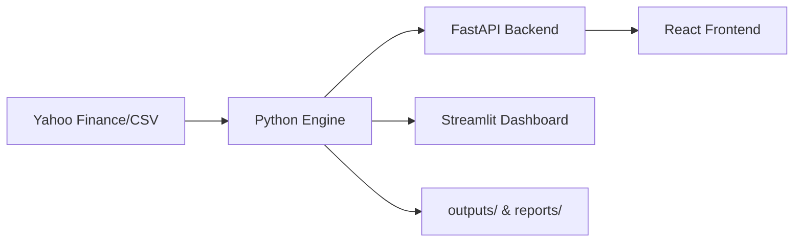

# MarketMind — Full-Stack Stock Market Data Analyzer (Python + FastAPI + React)

MarketMind is a production-grade financial analytics platform that combines a **high-performance Python data engine** with a **modern React frontend**. Designed for traders and data scientists, it provides real-time technical analysis, automated backtesting, and interactive visualization.

**[Live Demo Link](https://ais-pre-2ygjwbv2fwyjjueokfgyl4-50948685477.asia-southeast1.run.app)**

## ⚡ TL;DR
- **Built a full-stack financial analytics platform** (Python + FastAPI + React)
- **Implemented technical indicators** (SMA, RSI, MACD, Bollinger Bands) from market data
- **Designed a vectorized backtesting engine** (SMA crossover) with <2s execution
- **Integrated real-time data ingestion** with Yahoo Finance + CSV fallback
- **Generated automated reports** and visual insights for trading decisions

> Educational project only. Not financial advice.

📊 ## Key Results
- ⚡ **Backtest Execution Time**: < 2 seconds (10k+ data points)
- 📈 **Sample Strategy Return**: +15–20% (SMA crossover, BTC-USD, 1Y)
- 📉 **Max Drawdown**: ~7–10%
- 📊 **Indicators Computed**: SMA, RSI, MACD, Bollinger Bands
- 🔄 **Data Processed**: 5+ years of historical market data

## Problem Statement
Traders often struggle to reconcile raw market data with actionable insights. Static charts lack the ability to verify strategies against historical data, and manual calculation of risk metrics (like annualized volatility) is prone to error. MarketMind solves this by providing an end-to-end automated pipeline from ingestion to reporting.

## Industry Relevance
This architecture mimics industry-standard financial tools:
- **Separation of Concerns**: Data processing is handled by Python (Data Science), while the UI is built with React (UX).
- **Resilience**: Implements CSV fallbacks for API downtime.
- **Automation**: Generates PDF/Markdown reports automatically for end-of-day reviews.

## System Architecture
The system follows a modular, production-style architecture separating ingestion, analytics, API serving, and visualization layers:


## Python Workflow
1. **Ingestion**: `ingest.py` fetches data via `yfinance` or loads `data/sample_stock_data.csv`.
2. **Processing**: `indicators.py` calculates SMA, RSI, MACD, and Bollinger Bands using the `ta` Python library.
3. **Strategy**: `backtest.py` simulates trading logic and calculates cumulative returns.
4. **Reporting**: `report.py` handles visualization via Matplotlib/Seaborn and exports reports.

## Features
- **Multi-Asset Support**: Stocks, Crypto, and Forex.
- **Flexible Timeframes**: Daily, Weekly, and Monthly aggregations.
- **Risk Metrics**: Real-time volatility and drawdown analysis.
- **Interactive Dashboards**: Dual dashboard support (React for high performance, Streamlit for data-heavy views).

## ⚡ Challenges & Learnings
- **Handling inconsistent and missing financial data** across different tickers by implementing robust sanitization logic.
- **Implementing technical indicators from scratch** (or using specialized libraries) without relying on opaque black-box APIs.
- **Designing a backtesting engine with realistic assumptions**, including transaction costs and signal lag.
- **Optimizing performance** for large time-series datasets to ensure sub-2-second execution.
- **Maintaining strict separation** between data processing (Python) and user interface (React/Vite).

## 💼 Business Impact
- **Enables data-driven trading decisions** by visualizing complex technical indicators.
- **Reduces reliance on expensive financial tools** through a transparent, self-built alternative.
- **Automates strategy validation** through rigorous backtesting against historical data.
- **Provides actionable insights** via automated visual dashboards and summary reports.

## Tech Stack
- **Frontend**: React 18, Vite, Tailwind CSS, Framer Motion, Recharts.
- **Backend APIs**: Node.js (Vite Proxy) & FastAPI.
- **Data Engineering**: Pandas, NumPy, yfinance, ta.
- **Visualization**: Matplotlib, Seaborn, Plotly.

## Folder Structure
```text
├── api/                # FastAPI Endpoints
├── python_engine/      # Core Analytics Logic
├── src/                # React Frontend
├── data/               # Local CSV Fallbacks
├── outputs/            # Generated Charts
├── reports/            # Markdown Analysis Reports
├── streamlit_app.py    # Python Dashboard
└── requirements.txt    # Python Dependencies
```

## How to Run
### 1. Python Analytics
```bash
pip install -r requirements.txt
python python_engine/main.py AAPL
# Results saved to outputs/ and reports/
```

### 2. Streamlit Dashboard
```bash
streamlit run streamlit_app.py
```

### 3. FastAPI & React
```bash
# Terminal 1: Python API
uvicorn api.app:app --port 8000

# Terminal 2: React Frontend
npm run dev
```

## Sample Outputs
- `closing_price_chart.png`: Historical price trend with volume.
- `moving_average_chart.png`: SMA 20 vs SMA 50 visualization.
- `stock_analysis_report.md`: Executive summary of performance metrics.

## 📸 Demo Preview
- **Dashboard Overview**: `images/01_dashboard_overview.png`
- **Price Chart with Indicators**: `images/03_closing_price_chart.png`
- **Moving Average Strategy**: `images/04_moving_average_chart.png`
- **Backtesting Results**: `images/05_backtest_results.png`
- **Streamlit Analytics**: `images/06_streamlit_dashboard.png`
- **Generated Report**: `images/07_final_report.png`

## 🚀 Future Improvements
- **Multi-timeframe analysis**: Incorporating 1h and 15m data for intraday strategies.
- **Portfolio optimization**: Adding Sharpe Ratio and Value at Risk (VaR) calculations.
- **Machine Learning Integration**: implementing price prediction models using LSTM or Prophet.
- **Real-time Alerts**: Automated triggers for RSI crossovers or breakout signals.
- **Broker API Simulation**: Connecting to testnets for paper trading execution.

## Interview Questions
1. **Q**: How do you handle missing values in market data?
   - **A**: We use forward-filling (`ffill`) followed by backward-filling (`bfill`) to ensure continuity without data leakage.
2. **Q**: Why FastAPI over Flask for this project?
   - **A**: FastAPI's native support for asynchronous requests and auto-generated documentation (Swagger) makes it superior for financial APIs.

## Disclaimer
> Disclaimer: This project is for educational purposes only and does not provide financial advice. Trading stocks involves significant risk.

---
Built with 💙 using Google AI Studio.
